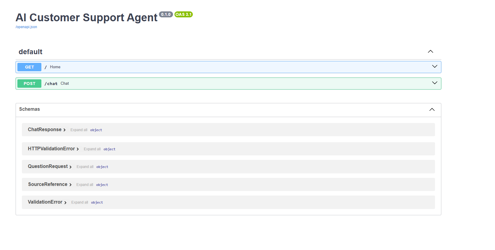
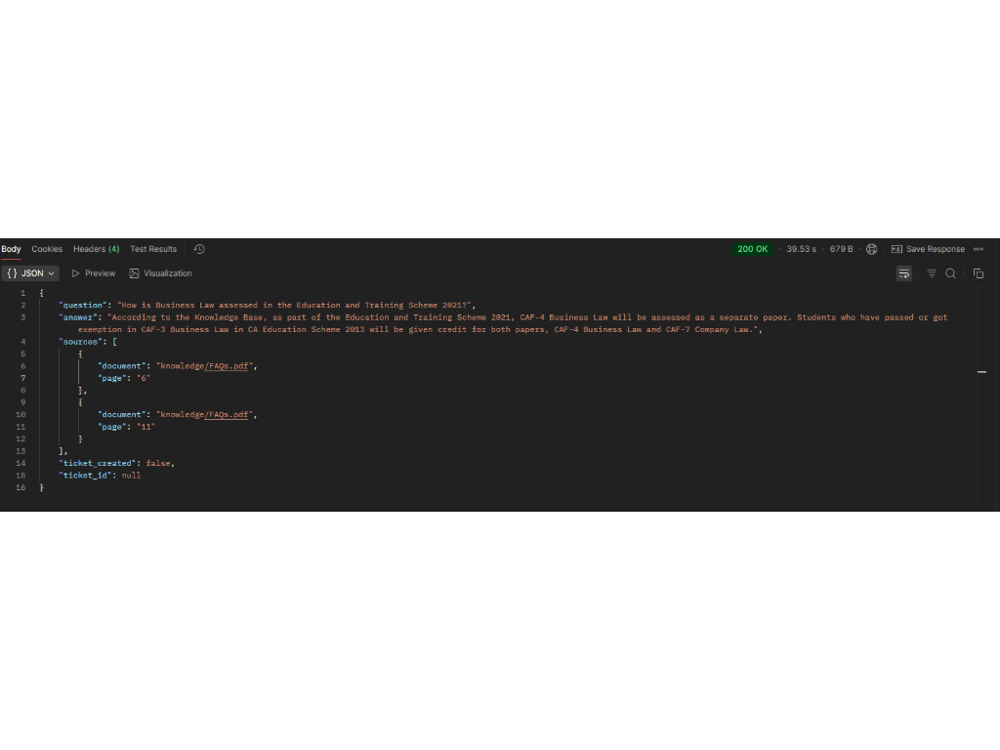
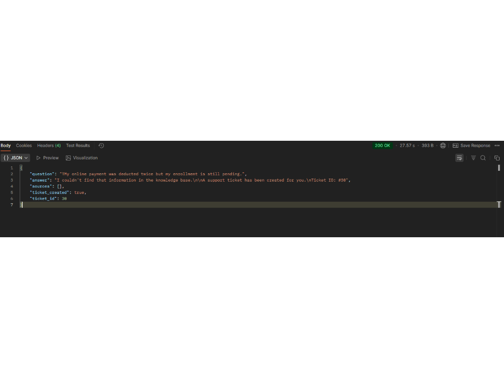
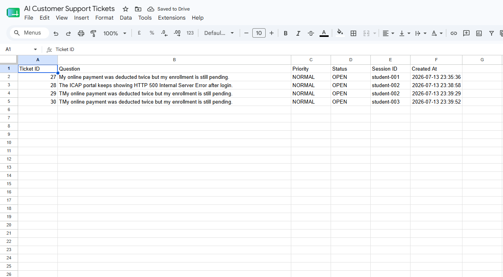
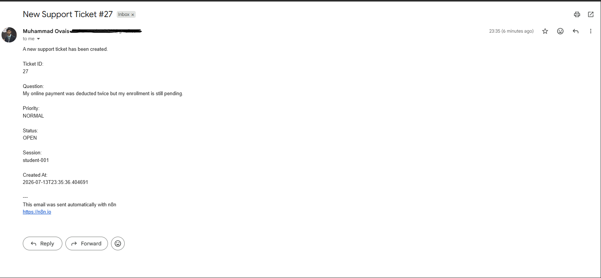

# 🤖 AI Customer Support Agent (Enterprise)

An enterprise-grade AI Customer Support Agent built with **FastAPI**, **Ollama (Llama 3.2)**, **ChromaDB**, **SQLite**, **Retrieval-Augmented Generation (RAG)**, and **n8n** automation.

The system intelligently answers customer queries using a knowledge base, maintains session-based conversation history, automatically escalates unresolved issues into support tickets, prevents duplicate ticket creation, and integrates with Google Sheets and Gmail for enterprise support workflows.

---

# ✨ Features

- ✅ FastAPI REST API
- ✅ Retrieval-Augmented Generation (RAG)
- ✅ Ollama (Llama 3.2)
- ✅ ChromaDB Vector Database
- ✅ nomic-embed-text Embeddings
- ✅ PDF Knowledge Base
- ✅ SQLite Database
- ✅ Session-Based Conversation Memory
- ✅ Source References
- ✅ Intent Classification
- ✅ Automatic Ticket Escalation
- ✅ Duplicate Ticket Prevention
- ✅ Existing Ticket Reuse
- ✅ n8n Workflow Integration
- ✅ Google Sheets Ticket Logging
- ✅ Gmail Email Notifications
- ✅ Enterprise Service-Layer Architecture

---

# 🏗️ AI Customer Support Agent Architecture


---

# ⚙️ Technology Stack

| Category | Technology |
|-----------|------------|
| Backend | FastAPI |
| Language | Python |
| AI Model | Ollama (Llama 3.2) |
| Embeddings | nomic-embed-text |
| Vector Database | ChromaDB |
| Database | SQLite |
| AI Technique | Retrieval-Augmented Generation (RAG) |
| Automation | n8n |
| Integrations | Google Sheets, Gmail |

---

# 📂 Project Structure

```text
AI-Customer-Support-Agent/
│
├── backend/
│   ├── app.py
│   ├── ingest.py
│   ├── requirements.txt
│   │
│   ├── models/
│   │   └── schemas.py
│   │
│   ├── services/
│   │   ├── database_service.py
│   │   ├── intent_service.py
│   │   ├── llm_service.py
│   │   ├── n8n_service.py
│   │   ├── rag_service.py
│   │   ├── ticket_service.py
│   │   └── vector_service.py
│   │
│   ├── knowledge/
│   │   └── FAQs.pdf
│   │
│   ├── database/
│   │
│   └── chroma_db/
│
├── images/
│   ├── architecture.png
│   ├── swagger-api.png
│   ├── demo-response-success.png
│   ├── demo-response-ticket.png
│   ├── n8n-workflow.png
│   ├── google-sheets.png
│   └── gmail-notification.png
│
├── n8n/
│   └── customer-support-workflow.json
│
├── README.md
├── LICENSE
└── .gitignore
```

---

# 🔄 System Workflow

```text
                           User
                             │
                             ▼
                     FastAPI REST API
                             │
                             ▼
                       RAG Service
                             │
        ┌────────────────────┼────────────────────┐
        │                    │                    │
        ▼                    ▼                    ▼
Conversation History     ChromaDB Search     Intent Service
    (SQLite)             (Knowledge Base)
        │                    │
        └────────────┬───────┘
                     ▼
             Ollama (Llama 3.2)
                     │
                     ▼
          Knowledge Available?
             │             │
            Yes            No
             │             │
             ▼             ▼
      Return Response   Ticket Service
                              │
                              ▼
                  Existing Ticket Check
                     │                │
                    Yes              No
                     │                │
                     ▼                ▼
              Reuse Ticket      Create Ticket
                                      │
                                      ▼
                               SQLite Database
                                      │
                                      ▼
                                n8n Webhook
                               ┌──────┴──────┐
                               ▼             ▼
                        Google Sheets     Gmail
```

---

# 📸 Screenshots

## Architecture


---

## FastAPI Swagger

Interactive API documentation.



---

## Knowledge Base Response

Successful response generated from the knowledge base with source references.



---

## Automatic Ticket Escalation

Automatic ticket creation when the requested information is unavailable in the knowledge base.



---

## n8n Workflow

Automated workflow for ticket processing.


---

## Google Sheets Integration

Automatically logs every support ticket.



---

## Gmail Notification

Automatic email notification after ticket creation.



---

# 🚀 API Endpoint

## POST /chat

### Request

```json
{
    "session_id": "student-001",
    "question": "What is Qualifying Assessment Test (QAT)?"
}
```

### Successful Response

```json
{
    "question": "What is Qualifying Assessment Test (QAT)?",
    "answer": "...",
    "sources": [
        {
            "document": "knowledge/FAQs.pdf",
            "page": "3"
        }
    ],
    "ticket_created": false,
    "ticket_id": null
}
```

### Ticket Escalation Response

```json
{
    "question": "The portal shows HTTP 500 Internal Server Error.",
    "answer": "I couldn't find that information in the knowledge base.\n\nA support ticket has been created for you.\nTicket ID: #26",
    "sources": [],
    "ticket_created": true,
    "ticket_id": 26
}
```

---

# 🔗 n8n Workflow

The exported workflow is available in:

```text
n8n/customer-support-workflow.json
```

Workflow Steps:

1. Receive ticket from FastAPI via Webhook
2. Process ticket information
3. Store ticket in Google Sheets
4. Send Gmail notification

---

# 🚀 Getting Started

## Clone Repository

```bash
git clone https://github.com/YOUR_USERNAME/AI-Customer-Support-Agent.git
```

## Navigate to Backend

```bash
cd AI-Customer-Support-Agent/backend
```

## Install Dependencies

```bash
pip install -r requirements.txt
```

## Build Knowledge Base

```bash
python ingest.py
```

## Start FastAPI Server

```bash
uvicorn app:app --reload
```

Open Swagger UI:

```text
http://127.0.0.1:8000/docs
```

---

# 💡 Enterprise Highlights

- Modular Service-Layer Architecture
- Enterprise RAG Pipeline
- AI-powered Knowledge Base Search
- Session-Based Conversation Memory
- Source Attribution
- Intent Classification
- Automatic Ticket Escalation
- Duplicate Ticket Prevention
- Existing Ticket Reuse
- Workflow Automation using n8n
- Google Workspace Integration

---

# 🔮 Future Enhancements

- JWT Authentication
- Role-Based Access Control (RBAC)
- Admin Dashboard
- Ticket Status Updates
- Customer Satisfaction Survey
- Slack Integration
- Microsoft Teams Integration
- Docker Support
- CI/CD Pipeline
- Redis Caching
- Unit & Integration Testing
- Monitoring & Logging

---

# 👨‍💻 Author

**Muhammad Ovais**

Senior Software Engineer | AI Automation Engineer

- GitHub: https://github.com/muhammadovais314
- LinkedIn: https://www.linkedin.com/in/muhammadovais314/

---

## ⭐ Support

If you found this project useful, consider giving it a ⭐ on GitHub.